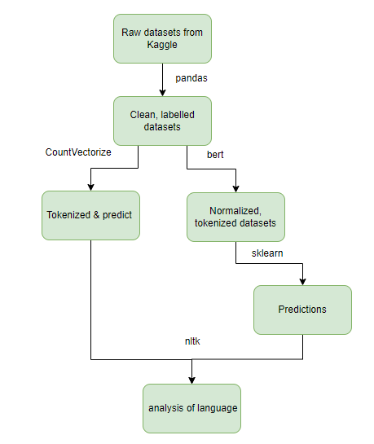

# Suicide Detection (CPS803)
### Abstract 
Project uses ML techniques in detecting a probable suicide message based on social media posts. 
For this purpose, we trained and tested classical machine learning classifiers such as Naïve Bayes, Support Vector Model, and Logistic Regression distinguish Reddit posts that indicate suicide and non-suicide.
The word associations derived from each method is used to identify posts with suicidal tendencies.

### Datasets  
 <table>
    <thead>
      <tr>
        <th>Datasets</th>
        <th>Intended Use</th>
        <th>Rows</th>
        <th>Description</th>
      </tr>
    </thead>
    <tbody>
        <tr>
            <td><i>Suicide Detection</i></td>
            <td>Training</td>
            <td>232,074</td>
            <td>Data from Kaggle. Data contains reddit posts that have been labelled as suicide and non-suicide.</td>
        </tr>
        <tr>
            <td><i>Suicide Notes</i></td>
            <td>Test</td>
            <td>464</td>
            <td>Data from Kaggle. Notes written by users who were confirmed with suicidal tendencies.</td>
        </tr>
            <tr>
            <td><i>r/depression r/SuicideWatch</i></td>
            <td>Test</td>
            <td>20,364</td>
            <td>Data from Kaggle. Data contains reddit posts from r/depression and r/suicidewatch.</td>
        </tr>
    </tbody>
  </table>
  
### Procedure
</td>
### Results - Classical Machine Learning Models

#### Suicide Detection Train-Test Split  
<i>Dataset is balanced and accurately labelled. </i>
<table>
    <thead>
      <tr>
        <th>Model</th>
        <th>BERT Accuracy</th>
        <th>Count Vectorize Accuracy</th>
      </tr>
    </thead>
    <tbody>
        <tr>
            <td><i>Logistic Regression</i></td>
            <td>81.08</td>
            <td>93.19</td>
        </tr>
        <tr>
            <td><i>Bernoulli Naive Bayes</i></td>
            <td>82.33</td>
            <td>77.75</td>
        </tr>
            <tr>
            <td><i>Multinomial Naive Bayes</i></td>
            <td>82.33</td>
            <td>90.25</td>
        </tr>
        </tr>
            <tr>
            <td><i>SVM</i></td>
            <td>82.33</td>
            <td>92.55</td>
        </tr>
        </tr>
            <tr>
            <td><i>MLP</i></td>
            <td>82.07</td>
            <td>94.52</td>
        </tr>
    </tbody>
  </table>

#### suicide_notes  
<i>Dataset is unbalanced and skewed to contain only sentences labelled as 'suicide'. </i>
<table>
    <thead>
      <tr>
        <th>Model</th>
        <th>BERT Accuracy</th>
        <th>Count Vectorize Accuracy</th>
      </tr>
    </thead>
    <tbody>
        <tr>
            <td><i>Logistic Regression</i></td>
            <td>59.50</td>
            <td>83.41</td>
        </tr>
        <tr>
            <td><i>Bernoulli Naive Bayes</i></td>
            <td>52.86</td>
            <td>59.05</td>
        </tr>
            <tr>
            <td><i>Multinomial Naive Bayes</i></td>
            <td>36.16</td>
            <td>94.83</td>
        </tr>
        </tr>
            <tr>
            <td><i>SVM</i></td>
            <td>59.04</td>
            <td>78.66</td>
        </tr>
        </tr>
            <tr>
            <td><i>MLP</i></td>
            <td>60.41</td>
            <td>97.84</td>
        </tr>
    </tbody>
  </table>

#### reddit_depression_suicidewatch  
<i>Dataset is balanced, but labels need not be accurate. </i>
<table>
    <thead>
      <tr>
        <th>Model</th>
        <th>BERT Accuracy</th>
        <th>Count Vectorize Accuracy</th>
      </tr>
    </thead>
    <tbody>
        <tr>
            <td><i>Logistic Regression</i></td>
            <td>44.98</td>
            <td>54.61</td>
        </tr>
        <tr>
            <td><i>Bernoulli Naive Bayes</i></td>
            <td>45.02</td>
            <td>45.30</td>
        </tr>
            <tr>
            <td><i>Multinomial Naive Bayes</i></td>
            <td>45.45</td>
            <td>49.43</td>
        </tr>
        </tr>
            <tr>
            <td><i>SVM</i></td>
            <td>44.86</td>
            <td>54.58</td>
        </tr>
        </tr>
            <tr>
            <td><i>MLP</i></td>
            <td>45.89</td>
            <td>53.73</td>
        </tr>
    </tbody>
  </table>

### Result
Count Vectorize perfromed better than BERT as a tokenizer.
Multinomial Naive Bayes classifier performed the best.

### Themes  
| Datasets                     | True Positives        | False Positives | False Negatives         |
| -----------------------------|:---------------------:| ---------------:| -----------------------:|
| *Testset*                    | regret                | social anxiety  | loneliness & depression |
| *Suicide Notes*              | goodbye notes         |                 | loneliness & anxiety    |
| *r/depression r/SuicideWatch*| regret & goodbye notes| social anxiety  | loneliness & anxiety    |

## Project Video

